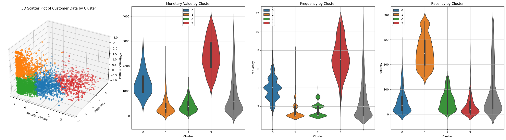

# Customer Segmentation Using KMeans on Retail Transaction Data

## Project Overview

This project aims to segment retail customers using a dataset of transaction records that include details such as invoice numbers, customer IDs, prices, and quantities. By aggregating the data, we extract key features like:

- **Monetary Value**: Total amount spent by each customer.
- **Frequency**: Total number of purchases made by each customer.
- **Recency**: Days since the last purchase made by each customer.

The goal is to perform **KMeans clustering** on the customer data to identify different customer segments based on their transactional behavior. These segments can be used for targeted marketing strategies, customer retention, and personalized offers.

## Key Steps

1. **Data Cleaning**: The dataset is cleaned by:
   - Filtering valid invoice numbers.
   - Removing records with missing customer IDs.
   - Calculating the potential data loss during this process.
   
2. **Feature Aggregation**: The key features (**Monetary Value**, **Frequency**, and **Recency**) are aggregated to create a new DataFrame, which will be used for the clustering analysis.

3. **Outlier Detection**: Outliers are identified across the features. These customers are particularly valuable, as they tend to spend more and purchase more frequently.
   - Data is divided into two groups:
     - **Normal Customers**: Used for KMeans clustering.
     - **Outlier Customers**: Will be analyzed separately in future phases.

4. **Data Normalization**: The features are normalized to ensure that they are on the same scale, which is crucial for the clustering process.

5. **KMeans Clustering**: The KMeans algorithm is applied to the normalized data to segment customers into different groups based on their purchasing behavior.

## Future Work

The analysis of outlier customers, who are currently excluded from the KMeans clustering, will be conducted in a subsequent phase. This will provide additional insights into high-value customers and potential strategies for maximizing their engagement.

## How to Use

1. Clone the repository.
2. Install the required dependencies using:
   ```bash
   pip install -r requirements.txt
   ```
3. Run the Jupyter notebook to explore the cleaning process, feature aggregation, and KMeans clustering analysis.

